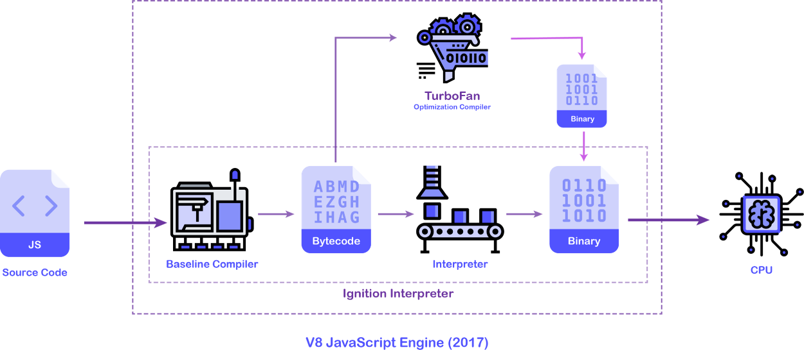
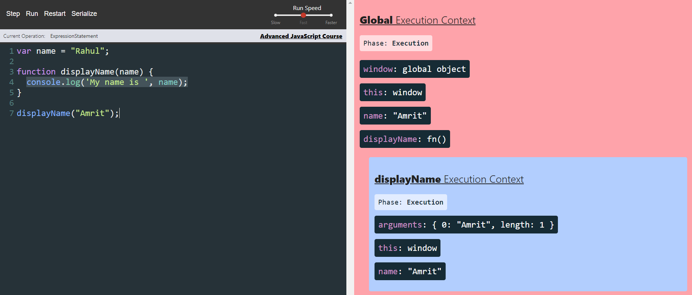

# Questions
## JavaScript
- [How does JavaScript works. JS engine archietecture. How JavaScript is so fast.](#Q1)
- [Explain event loop.](#Q2)
- [Explain execution context.](#Q3)
- [What is hoisting? Explain with example.](#Q4)
- [Scope chain.](#Q5)
- [var, let, const,Temporal Dead Zone.](#Q6)
- [What is type of null, undefined, function, NaN.](#Q7)
- [null and undefined.](#Q8)
- [typeOf() ](#Q9)
- [Difference between == and === ](#Q10)
- [How does this keyword work? Provide some examples.](#Q11)
- [Difference between call, apply and bind. Give example. ](#Q12)
- [What is closure and what are the advantages of using closure. ](#Q13)
- [Function statement, Function Expression, Anonymous Function, Named Function Expression, First Class Function, Higher-order Function.](#Q14)
- [Difference between arguments and parameters.](#Q15)
- [Function overiding and overloading.](#Q16)
- [OOPs concept in JS](#Q17)
   - Objects
   - classes
   - Encapsulation (constructor functions)
   - Inheritance (prototypal inheritance) with example
- [Implement debouncing.](#Q18)
- [Implement throttling.](#Q19)
- [IIFE (Immediately Invoked Function Expression)](#Q20)
- [Function currying with example.](#Q21)
- [Difference between setTimeout vs setInterval.](#Q22)
- [Implement setInterval using setTimeout](#Q23)
- [What is the difference between window, screen, and document in Javascript?](#Q24)
- [Falsy values in js.](#Q25)
- [What is a strict mode in js?](#Q26)
- [What is eval()?](#Q27)
- [What are reference error and syntax error?](#Q28)
- [JavaScript data types.](#Q29)
- [Insert content in HTML using JavaScript. ](#Q30)
- [HTML DOM (Document Object Model)](#Q31)
- [BOM (Browser Object Model)](#Q32)
- [alert, confirm and popup](#Q33)
- [cookies, sessions and localstorage](#Q34)
- [Array methods](#Q35)
- [String methods](#Q36)
- [Different errors in JS.](#Q37)
- [isNaN() ](#Q38)

## JavaScript ES6
- [Explain features of ES6.](#QA1)
- [Difference between the arrow and normal function.](#QA2)
- [Explain what the callback function is and provide a simple example.](#QA3)
- [Promises](#QA4)
- [Async-await](#QA5)
- [Spread operator, rest and destructing.](#QA6)
- [Iterators.](#QA7)
- [Import and export.](#QA8)
- [Pollyfill for map, reduce, filter and forEach.](#QA9) 
- [Pollyfill for call, apply,bind.](#QA10)
- [Polyfill for flat method](#QA11)
   - Infinite depth flatten and flatten by a certain number
   - Implement both recursive and iterative approaches
- [Polyfill for promises and Promise.all](#QA12)
- [Event bubbling, event capturing/trickling, and event delegation.](#QA13)
- [Difference between stop propagation and prevent default method.](#QA14)
- [Explain map, forEach, filter and reduce higher order functions](#QA15) 

## JavaScript Array, Objects, etc.
- [How to empty an array.](#QB1)
- [Remove duplicate values from an array.](#QB2)
- [Explain with examples of a deep and shallow copy.](#QB3)
- [Remove falsy values from Array.](#QB4)
- [Shuffle elements in an array.](#QB5)
- [splice vs slice method.](#QB6)
- [What is array destructuring.](#QB7)
- [Different ways of creating an object.](#QB8)
- [Object creation patterns.](#QB9)
- [Deep copy of an object.](#QB10)
- [Check if a given object is empty or not.](#QB11)
- [Add/remove properties from Objects.](#QB12)
- [Given a string, reverse each word in the sentence.](#QB13)
- [Given two strings, return true if they are anagrams of one another.](#QB14)
- [Find a maximum consecutive repeating char in a given string.](#QB15)

## JavaScript Misc
- [What are the advantages of using Axios over Fetch API.](#QC1)
- [Explain the CORS mechanism.](#QC2)
- [Explain JWT in detail.](#QC3)
- [Use AJAX and XMLHttpRequest to get reponse from an URL. ](#QC4)

## Web Performance
- [Critical rendering path (must watch)](#QD1)
- [Caching](#QD2)
   - HTTP requests: Headers like Cache-Control, ETag, and Transfer-Encoding
- [Network waterfall](#QD3)
- [Async, defer script attributes](#QD4)
- [preconnect, preload, prefetch](#QD5)
- [Image optimization (jpeg v/s png v/s svg)](#QD6)
- [Bundle size optimisation ( good to have webpack basics)](#QD7)

## Web security
- [XSS ( understand why we need cookies )](#QE1)
- [CSRF](#QE2)
- [Content security policy](#QE3)

## Old Questions
* [JavaScript can display data in following ways](#javascript-can-display-data-in-following-ways)
* [JavaScript Data Types](#javascript-data-types)
* [JavaScript Objects](#some-of-the-javascript-objects-are)
* [Creating an object](#creating-an-object)
* [isNAN()](#isnan)
* [void(0)](#void0)
* [Tainted property in javascript](#tainted-property-in-javascript)

# Answers
#### Q1 
### ✍How does JavaScript works. JS engine archietecture. How JavaScript is so fast.
JavaScript is a **dynamically** typed language unlike C++.
```js
var x = 17;
```
- when we define `x`, we don't worry about the type of the variable or the memory it will take. This makes prototyping fast.
- JS Engine use JIT (Just In Time) Compilation. It interpretes and compiles at the same time.
- Modern JS engines are 2 compilers, one is optimizing compiler. Its job is to re-compile `hot functions` with type information and optimize it in the process.
- If the type is changed, then it has to de-optimize (small performance hit).
- Google Chrome browser's V8 engine is the fastest. Here, the baseline compiler is Ignition. The optimising compiler is Turbofan. The machine code is called Bytecode.



**[⬆](#Questions)**
---
#### Q2
### ✍Explain event loop.

JavaScript is a **single threaded language**, i.e., it can execute one line at a time.
1. The JavaScript Engine has a `memory heap` and `call stack`. Even before executing a single line of code, JS stores variables and functions in the heap. Variables are assigned "undefined" and functions are stored as it.
2. After that `Global Execution Context` is created in the call stack. Each line is executed synchronously and after execution, gets popped out of the call stack.
3. All the asynchronous events like `setTimeout` or **DOM APIs** or `XMLHttpRequest` are part of the **WebAPI**. When the timer expires or the reponse is fetched, it goes to the **callback queue**, where it waits for the call stack to be clear. Event loop checks this functionality.
5. Once the call stack is empty, event loop pushes the callback functions, which are waiting in the callback queue, to the call stack, to be executed. 
6. Suppose, there is a fetch request (Promise) and also a setTimeout. In this case, Promises gets pushed to the **microtask queue**, after getting response. Microtask queue has more priority than callback queue (or task queue). So once the call stack is cleared, functions in the microtask queue gets pushed. After that callback functions in callback queue gets executed.


**[⬆](#Questions)**
---
#### Q3
### ✍Explain execution context.
1. Before even code is executed, there is Global Execution Context. In GEC, `window` and `this` is available to us. Here, `this` refers to `window` Object.
2. Once code is executed, variable names are assigned value. For a function, a separate Execution Context is created. Here, `arguments` and `this` is available to us. For each function call, seperation Execution Contexts are created.
3. Execution Context has 2 phases: Creation and Execution.


**[⬆](#Questions)**
---
#### Q4
### ✍What is hoisting? Explain with example.
- JavaScript Hoisting refers to the process whereby the interpreter appears to move the declaration of functions, variables or classes to the top of their scope, prior to execution of the code.
- `var` variables are initialized with undefined, `let` and `const` variables are not initialized.
- Functions are hoisted as it is. Hence, we can run a function before we declare.

**[⬆](#Questions)**
---
#### Q5
### ✍Scope chain.
It refers to the **lexical environment**. If a variable or a function is not declared in its scope, but it is declared in its lexical parent, then that variable can be accessed in the function also.
```js
function name() {
   var name = "Amrit";
   function displayName() {
      console.log(name);
   }
   displayName();
}
name();
```

**[⬆](#Questions)**
---
#### Q6
### ✍var, let, const,Temporal Dead Zone.
- `var` declarations are globally scoped or function scoped while `let` and `const` are block scoped.
- `var` variables can be updated and re-declared within its scope; `let` variables can be updated but not re-declared; `const` variables can neither be updated nor re-declared.
- They are all hoisted to the top of their scope. But while var variables are initialized with undefined, `let` and `const` variables are not initialized.
- While `var` and `let` can be declared without being initialized, `const` must be initialized during declaration.

**[⬆](#Questions)**
---
#### Q7
### ✍What is type of null, undefined, function, NaN.
```js
console.log(typeof null);  // "object"
console.log(typeof undefined); // "undefined"
console.log(typeof function demo() {}); // "function"
console.log(typeof NaN); // "number"
```

**[⬆](#Questions)**
---
#### Q8
### ✍null and undefined.
- the type of undefined is `undefined`, whereas null is `object`.
- When a variable is declared but no value is assigned, then it shows undefined. But we can assign to a variable. So `null` is an assignment value.

**[⬆](#Questions)**
---
#### Q9
### ✍typeOf() 
```js
console.log(typeof undefined); // "undefined"
console.log(typeof null);  // "object"
console.log(typeof "John"); // "string"
console.log(typeof 3.14); // "number"
console.log(typeof x); // "undefined"
console.log(typeof true); // "boolean"
console.log(typeof {'Name': 'Amrit', 'age': 23}); // "object"
console.log(typeof [1, 2, 3]); // "object"
console.log(typeof function demo() {}); // "function"
```

**[⬆](#Questions)**
---
#### Q10
### ✍Difference between == and === . 
- `==` converts the variable values to the same type before performing comparison. This is called **type coercion**. 
- ===` does not do any type conversion (coercion) and returns true only if both values and types are identical.

**[⬆](#Questions)**
---
#### Q11
### ✍How does this keyword work? Provide some examples.
- Case 1
```js
function displayName() {
   console.log('John Doe', this);
}
displayName();
```
In case `this` is the window object as internally `window.displayName()` is getting called.
- Case 2
```js
let obj1 = {
   displayName: function() {
      console.log('John Doe', this);
   }
}
obj1.displayName();
```
In case 2, this will refer to `obj1`.
- `this` keyword works dynamically. Let's take another example.
- Case 3
```js
const obj = {
   name: 'Amrit',
   sayHello: function() {
      console.log('Hello', this);
      var sayBye = function() {
         console.log('Bye', this);
      }
      sayBye();
   }
}
obj.sayHello();
// Hello {name: 'Amrit', sayHello: ƒ}
// Bye Window {window: Window, self: Window, document: document, name: '', location: Location, …}
```
- In case 3, `sayHello()` will refer to obj as we're calling as `obj.sayHello()`. But `sayBye()` will refer to `window` object as we're simply calling the function `sayBye()`.
- But if we will use arrow function in `sayBye()`, arrow function will check where the function is defined and log `this`. 
```js
const obj = {
   name: 'Amrit',
   sayHello: function() {
      console.log('Hello', this);
      var sayBye = () => {
         console.log('Bye', this);
      }
      sayBye();
   }
}
obj.sayHello();
// Hello {name: 'Amrit', sayHello: ƒ}
// Bye {name: 'Amrit', sayHello: ƒ}
```
In this case, arrow function is defined within `obj`. So this will log `obj` object.

**[⬆](#Questions)**
---
### Q12
✍Difference between `call`, `apply` and `bind`. Give example.
When we call this below function, internally `displayName()` is called as `displayName.call()`. Also we can call this function with `apply()` like this also, `displayName.apply()` 
```js
function displayName() {
   console.log('John Doe');
}
displayName(); // John Doe
displayName.call(); // John Doe
```
- call()
```js
let user1 = {
   name: 'John',
   battery: 30,
   chargeBattery: function(isCharging, isNotSwitchedOff) {
      this.battery = (isCharging && isNotSwitchedOff) ? 100 : '';
   }
}
let user2 = {
   name: 'Ron',
   battery: 70
}
// call the chargeBattery() present in user1 and use it in user2 
user1.chargeBattery.call(user2, true, true); /
console.log(user1); // {name: 'John', battery: 30, chargeBattery: ƒ}
console.log(user2); //{name: 'Ron', battery: 100}
```
- apply(): for `apply()`, all the arguments should be in array
```js
let user1 = {
   name: 'John',
   battery: 30,
   chargeBattery: function(isCharging, isNotSwitchedOff) {
      this.battery = (isCharging && isNotSwitchedOff) ? 100 : '';
   }
}
let user2 = {
   name: 'Ron',
   battery: 70
}
// call the chargeBattery() present in user1 and use it in user2 
user1.chargeBattery.bind(user2, [true, true]); // for apply(), all the arguments should be in array
console.log(user1); // {name: 'John', battery: 30, chargeBattery: ƒ}
console.log(user2); // {name: 'Ron', battery: 100}
```
- bind(): `bind()` return a function so that later we can call that function.
```js
let user1 = {
   name: 'John',
   battery: 30,
   chargeBattery: function(isCharging, isNotSwitchedOff) {
      this.battery = (isCharging && isNotSwitchedOff) ? 100 : '';
   }
}
let user2 = {
   name: 'Ron',
   battery: 70
}
let output = user1.chargeBattery.bind(user2, true, true);
output();
console.log(user2); //{name: 'Ron', battery: 100}
```

**[⬆](#Questions)**
---
#### Q13
### ✍What is closure and what are the advantages of using closure.
**Functions bundled with its lexical scope is called closure.**
- Example
```js
function x() {
   let a = 8;
   function y() {
      console.log(a);
   }
   return y;
}
let z = x(); // returns the function y
console.log(z); // 8
```
- Here, we have to understand when we call `x()`, the `function y` will be returned along with its lexical scope. So even if `function x()` is no longer executed and it doesn't exist anymore, in the variable z, the `function y()` is present along with its lexical scope. So the reference of `a` is present.
- So when we call `z()`, 8 gets printed. In other words, it remembers its lexical scope. The reference to `a` is also stored in variable `z`. Hence 8 gets printed as `a = 8`. 
- The reference of `a` is stored. Hence, if we change `a = 12` after `function y()`, the value will change to 12 and it will console log 12.

- Uses of Closure
   - Module Design Pattern
   - Currying
   - Functions like once()
   - Memoize
   - Maintaining state in async world
   - setTimeouts
   - Iterators
- Limitations
   - The variables and functions are not garbage collected as its there in scope. So leads to memory leaks and memory waste.

**[⬆](#Questions)**
---
#### Q14
### ✍Function statement, Function Expression, Anonymous Function, Named Function Expression, First Class Function, Higher-order Function.
- Function Statement or Function Declaration
```js
function a() {
   console.log('a is called');
}
a(); // a is called
```
- Function Expression. Here, it is treated as a variable, so it is not hoisted. On the other hand, Function Statement is hoisted.
```js
let b = function () {
   console.log('b is called');
}
b();  // b is called
```
- Anonymous Functions are used when functions are used as values, just like Function Expression as an example.

- Named Function Expression
```js
let c = function abc() {
   console.log('c is called', abc);
}
c(); 
// c is called ƒ abc() {
//    console.log("c is called", abc);
// }
```
We can't call this function like `abc()` as it is defined as a value .
- First Class Function (or First Class Citizens)
The ability to pass functions as values or pass functions inside a function as arguments is known as First Class Function. We can also return a function from function. 
- Higher-order Function
A **higher-order function** is a function that accepts functions as parameters and/or returns a function.

**[⬆](#Questions)**
---
#### Q15
### ✍Difference between arguments and parameters.
```js
function sum(a,b) {
   return a+b;
}
console.log(sum(2, 3));
```
a, b are the parameters. 2, 3 are `arguments`.
The values which we pass insde a function are called as `arguments` and the labels or identiers which gets those values are known as `parameters`.

**[⬆](#Questions)**
---
#### Q16
### ✍Function overiding and overloading.
- Function overloading is a feature of object oriented programming where two or more functions can have the same name but different parameters. When a function name is overloaded with different jobs it is called Function Overloading. But this is present C++. **In JavaScript, there is no Function Overloading**.
- JavaScript supports overriding, so if you define two functions with the same name, the last one defined will override the previously defined version and every time a call will be made to the function, the last defined one will get executed.

**[⬆](#Questions)**
---

#### Q17
### ✍OOPs concept in JS (Objects, Classes, Encapsulation(constructor), Inheritance(prototypal with example))

**[⬆](#Questions)**
---
#### Q18
### ✍Implement debouncing.

**[⬆](#Questions)**
---
#### Q19
### ✍Implement throttling.

**[⬆](#Questions)**
---
#### Q20
### ✍IIFE (Immediately Invoked Function Expression)
An Immediately-Invoked Function Expression, or IIFE for short executes immediately after it’s created. The primary reason to use an IIFE is to obtain data privacy. Because JavaScript's var scopes variables to their containing function, any variables declared within the IIFE cannot be accessed by the outside world.
```js
var budgetController = (function() {
    var x = 23;

    function add(a) {
        return x + a;
    }

    return {
        publicTest: function (b) {
            console.log(add(b)); 
        } // has access to x and add() as its a closure. even if IIFE is returned immediately, closure still has access to x and add().
    }
})();

// this is a IIFE which helps in data privacy. x and add() are private and so can't be accessed from outside. We use return object in order to get the value when we access from outside.

budgetController.x
// undefined

budgetController.add(5)
// Uncaught TypeError: budgetController.add is not a function\

budgetController.publicTest(5)
// 28
```

**[⬆](#Questions)**
---
#### Q21
### ✍Function currying with example.
Currying is a transformation of functions that translates a function from callable as `f(a, b, c)` into callable as `f(a)(b)(c)`.

Currying doesn’t call a function. It just transforms it.
```js
function curry(a) {
   return function (b) {
      return function (c) {
         return a * b * c;
      };
   };
}
console.log(curry(11)(2)(3));
```

**[⬆](#Questions)**
---
#### Q22
### ✍Difference between setTimeout vs setInterval.
- setTimeout(function, milliseconds)
Executes a function, after waiting a specified number of milliseconds.
```js
function showTime() {
   setTimeout(function() {
       alert('Hello');
   }, 1000);
}
```
- setInterval(function, milliseconds)
Same as `setTimeout()`, but repeats the execution of the function continuously.
```js
<button onclick="showTime()">Show Time</button>
<p id="time"></p>

function showTime() {
   setInterval(function() {
       var d = new Date();
       var t = d.toLocaleTimeString();
       document.getElementById("time").innerHTML = t;
   }, 1000);
}
```
- clearInterval()
The `clearInterval()` method stops the execution of the function specified in `setInterval()`.
```js
<button onclick="startTime()">Start</button>
<button onclick="stopTime()">Stop</button>

function startTime() {
   myVar = setInterval(function(){ myTimer() }, 1000);

   function myTimer() {
       var d = new Date();
       var t = d.toLocaleTimeString();
       document.getElementById("time").innerHTML = t;
   }
}

function stopTime() {
   clearInterval(myVar);
}
```

**[⬆](#Questions)**
---
#### Q23
### ✍Implement setInterval using setTimeout

**[⬆](#Questions)**
---
#### Q24
### ✍What is the difference between window, screen, and document in Javascript?
The`window` is the actual global object.
The`screen` is the screen, it contains properties about the user's display.
The`document` is where the DOM is.


**[⬆](#Questions)**
---
#### Q25
### ✍Falsy values in js.

**[⬆](#Questions)**
---
#### Q26
### ✍What is a strict mode in js
- Strict mode makes it easier to write **secure** JavaScript.
- Strict mode changes previously accepted **bad syntax** into real errors.
- As an example, in normal JavaScript, mistyping a variable name creates a new global variable. In **strict** mode, this will throw an error, making it impossible to accidentally create a global variable.
- Using a variable, without declaring it, is not allowed.

**[⬆](#Questions)**
---
#### Q27
### ✍What is eval()

**[⬆](#Questions)**
---
#### Q28
### ✍What are reference error and syntax error?

**[⬆](#Questions)**✍
---

#### Q29
### ✍JavaScript data types.
- Number
- String
- Boolean
- Undefined
- Null

**[⬆](#Questions)**
---
#### Q30
### ✍Insert content in HTML using JavaScript.
- document.getElementById('id').innerHTML

**[⬆](#Questions)**
---
#### Q31
### ✍HTML DOM (Document Object Model)\
HTML Document Object Model (DOM)is a standard Object model and programming interface for HTML. It defines all HTML elements as objects, the properties of HTML elements, the methods to access all HTML elements and the events for all HTML objects.\
In general, the HTML DOM is a standard for how to get, change, add, or delete HTML elements.\
Some examples of DOM

- document.getElementById()
- document.querySelector()
- document.getElementsByTagName()
- document.getElementsByClassName()
- element.innerHTML (new html content)
- element.attribute (new value)
- element.style.property (new style)
- document.createElement(element), document.removeChild(element),  document.appendChild(element),  document.replaceChild(element),  document.removeChild(element)

```js
// document.getElementById()
<input type="text" id="text1" />
document.getElementById('text1').value = 9999;

// document.querySelector()
document.querySelector('.demo').innerHTML = "Hello";

// document.getElementsByTagName()
// The getElementsByTagName() method returns a collection of all elements in the document with the specified tag name.
<h4 id="demo">Check the console for details.</h4>
<ul>
       <li>Ice cream</li>
       <li>Honey</li>
       <li>Vanilla</li>
</ul>
var x = document.getElementsByTagName("li");
document.getElementById("demo").innerHTML = x[1].innerHTML;

// document.getElementsByClassName
<h4 id="demo" class="demo">Check the console for details.</h4>
var x = document.getElementsByClassName('demo');
x[0].innerHTML = 'hello';

// element.innerHTML
<h4 id="demo" class="demo">Check the console for details.</h4>
document.getElementById('demo').innerHTML = "inner html changed";

// element.attribute
<a href="#" id="link">Link</a>
var a = document.getElementById('link').attributes.length;
console.log(a); //2

// element.setAttribute(attribute, value)
document.getElementById('link').setAttribute('href', 'https://www.google.co.in/');
document.getElementById('text1').setAttribute('type', 'button');

// element.style.property = new style
document.getElementById('link').style.color = "red";
document.getElementById('link').style.textTransform = "uppercase";

// document.createElement(element), document.removeChild(element),  document.appendChild(element),  document.replaceChild(element),  document.removeChild(element)
var btn = document.createElement("button");
var t = document.createTextNode("Click Me");
var nw = document.createTextNode("New");
btn.appendChild(t);
btn.replaceChild(nw, t);
document.getElementById('link').appendChild(btn);
document.getElementById('link').removeChild(btn);
```

**[⬆](#Questions)**
---
#### Q32
### ✍BOM (Browser Object Model)
The Browser Object Model (BOM) allows JavaScript to "talk to" the browser.
- The Window Object
   - `window.innerHeight`: the inner height of the browser window (in pixels)
   - `window.innerWidth`: the inner width of the browser window (in pixels)
   - `window.open()`: open a new window
   - `window.close`: closes the current window
   - `window.moveTo`: moves the current window
   - `window.resizeTo`: resize the current window
```js
// window.innerHeight()
console.log("Window innerWidth: " + innerWidth);
console.log("Window innerHeight: " + innerHeight);

// window.open()
<button type="button" id="btn" onclick="a()">Click me</button>

function a() {
   var x = window.open("", "MsgWindow", "width=200,height=100");
   x.document.write("<p>This is 'MsgWindow'. I am 200px wide and 100px tall!</p>")
}
```

- The Window Screen
The window.screen object contains information about the user's screen.
   - `screen.width`
   - `screen.height`
   - `screen.availWidth`
   - `screen.availHeight`
   - `screen.colorDepth`
   - `screen.pixelDepth`

- The Window Location
The `window.location` object can be used to get the current page address (URL) and to redirect the browser to a new page.
   - `window.location.href` returns the href (URL) of the current page
   - `window.location.hostname` returns the domain name of the web host
   - `window.location.pathname` returns the path and filename of the current page
   - `window.location.protocol` returns the web protocol used (http: or https:)
   - `window.location.assign` loads a new document

- The Window History
   - `history.back()` -same as clicking back in the browser
   - `history.forward()` -same as clicking forward in the browser

- The Window Navigator
The `window.navigator` object contains information about the visitor's browser. The `window.navigator` object can be written without the window prefix.

**[⬆](#Questions)**
---
#### Q33
### ✍alert, confirm and popup
- Alert box: `window.alert()` instructs the browser to display a dialog with an optional message, and to wait until the user dismisses the dialog.
```js
alert('Hi There!');
```
- Confirm box: `window.confirm()` instructs the browser to display a dialog with an optional message, and to wait until the user either confirms or cancels the dialog.
```js
if (confirm("Press a button!")) {
   console.log('You pressed OK');
} else {
   console.log('You pressed cancelled.');
}
```
- Prompt box: `window.prompt()` instructs the browser to display a dialog with an optional message prompting the user to input some text, and to wait until the user either submits the text or cancels the dialog
```js
var person = prompt("Please enter your name", "");

if (person == null || person == "") {
   console.log('You cancelled the prompt');
} else {
   console.log("Hello " + person + "! How are you today?");
}
```

**[⬆](#Questions)**
---
#### Q34
### ✍cookies, sessions and localstorage
| Cookies                   | Sessions           | Localstorage  |
| ------------------------  |:------------------------:| ------------------------:|
| The storage capacity of local storage is 5MB/10MB      | The storage capacity of session storage is 5MB | The storage capacity of Cookies is 4KB |
| As it is not session-based, it must be deleted via javascript or manually | It’s session-based and works per window or tab. This means that data is stored only for the duration of a session, i.e., until the browser (or tab) is closed | Cookies expire based on the setting and working per tab and window |
| The client  can only read local storage | The client can only read local storage | Both clients and servers can read and write the cookies |
| There is no transfer of data to the server | There is no transfer of data to the server | Data transfer to the server is exist |
| There are fewer old browsers that support it | There are fewer old browsers that support it | It is supported by all the browser including older browser |

**[⬆](#Questions)**
---
#### Q35
### ✍Array methods
```js
// concat()
var arr1 = ["cricket", "football", "hockey", "baseball", "kabaddi"];
var arr2 = ["india", "usa", "uk","china", "russia", "germany"];
var concat = arr1.concat(arr2);
console.log(concat);

RESULT:
["cricket", "football", "hockey", "baseball", "kabaddi", "india", "usa", "uk", "china", "russia", "germany"]

// fill()
var arr1 = ["cricket", "football", "hockey", "baseball", "kabaddi"];
var fill = arr1.fill("soccer");
console.log(fill);

RESULT:
["soccer", "soccer", "soccer", "soccer", "soccer"]

// indexOf()
var arr1 = ["cricket", "football", "hockey", "baseball", "kabaddi"];
var indexOf = arr1.indexOf("hockey");
console.log(indexOf);

RESULT:
2

// join()
var arr1 = ["cricket", "football", "hockey", "baseball", "kabaddi"];
var join = arr1.join();
console.log(join);

RESULT:
cricket,football,hockey,baseball,kabaddi

// map()
var arr1 = [4, 9, 16, 25, 36];
var map = arr1.map(Math.sqrt);
console.log(map);

RESULT:
[2, 3, 4, 5, 6]

// shift()
var arr1 = ["cricket", "football", "hockey", "baseball", "kabaddi"];
var shift = arr1.shift();
console.log(shift);
console.log(arr1);
RESULT:
Cricket
["football", "hockey", "baseball", "kabaddi"]

// unshift()
var arr1 = ["cricket", "football", "hockey", "baseball", "kabaddi"];
var unshift = arr1.unshift("golf");
console.log(unshift);
console.log(arr1);

RESULT:
6
["golf", "cricket", "football", "hockey", "baseball", "kabaddi"]

// pop()
var arr1 = ["cricket", "football", "hockey", "baseball", "kabaddi"];
var pop = arr1.pop();
console.log(pop);
console.log(arr1);

RESULT:
Kabaddi
["cricket", "football", "hockey", "baseball"]

// push()
var arr1 = ["cricket", "football", "hockey", "baseball", "kabaddi"];
var push = arr1.push("golf");
console.log(push);
console.log(arr1);
RESULT:
6
["cricket", "football", "hockey", "baseball", "kabaddi", "golf"]

// reverse()
var arr1 = ["cricket", "football", "hockey", "baseball", "kabaddi"];
var reverse = arr1.reverse();
console.log(reverse);

RESULT:
["kabaddi", "baseball", "hockey", "football", "cricket"]

// slice()
var arr1 = ["cricket", "football", "hockey", "baseball", "kabaddi"];
var slice = arr1.slice(1, 3);
console.log(slice);

RESULT:
["football", "hockey"]

// sort()
var arr1 = ["cricket", "football", "hockey", "baseball", "kabaddi"];
var sort = arr1.sort();
console.log(sort);

RESULT:
["baseball", "cricket", "football", "hockey", "kabaddi"]

// splice()
var arr1 = ["cricket", "football", "hockey", "baseball", "kabaddi"];
var splice = arr1.splice(1, 2, "golf"); //splice(position, howmany, items,...)
console.log(splice);
console.log(arr1);

RESULT:
["football", "hockey"]
["cricket", "golf", "baseball", "kabaddi"]

// toString()
var arr1 = ["cricket", "football", "hockey", "baseball", "kabaddi"];
var toString = arr1.toString();
console.log(toString);

RESULT:
cricket,football,hockey,baseball,kabaddi

// split()
var arr1 = "How are doing today?";
var split = arr1.split(" ");
console.log(split);
console.log(arr1.split(" ").reverse().join());

RESULT:
["How", "are", "doing", "today?"]
today?,doing,are,How
```

**[⬆](#Questions)**
---
#### Q36
### ✍String methods
Some of the common String methods are
- `str.length`
- `str.slice(start, end)`
- `str.substring(start, end)`
- `str.substr(start, length)`
- `str.replace()`
- `str.toUpperCase()`
- `str.toLowerCase()`
- `str.concat()`
- `str.trim()`
- `str.padStart()`
- `str.padEnd()`
- `str.charAt(position)`
- `str.charCodeAt(position)`
- `str.split()`

**[⬆](#Questions)**
---
#### Q37
### ✍Different errors in JS.
- `Error` objects are thrown when runtime errors occur. The `Error` object can also be used as a base object for user-defined exceptions.

- `Error()`: Creates a `new Error` object.

- `EvalError`: Creates an instance representing an error that occurs regarding the global function `eval()`.

- `RangeError`: Creates an instance representing an error that occurs when a numeric variable or parameter is outside of its valid range.

- `ReferenceError`: Creates an instance representing an error that occurs when de-referencing an invalid reference.

- `SyntaxError`: Creates an instance representing a syntax error.

- `TypeError`: Creates an instance representing an error that occurs when a variable or parameter is not of a valid type.

- `URIError`: Creates an instance representing an error that occurs when `encodeURI()` or `decodeURI()` are passed invalid parameters.

- `AggregateError`: Creates an instance representing several errors wrapped in a single error when multiple errors need to be reported by an operation, for example by `Promise.any()`.

**[⬆](#Questions)**
---
#### Q38
### ✍isNaN()
```js
console.log(isNaN('the'));      //true
console.log(isNaN(25));         //false
console.log(isNaN('23'));       //false
console.log(isNaN(NaN));       // true
console.log(isNaN(undefined)); // true
console.log(isNaN({}));        // true
console.log(isNaN(true));      // false
console.log(isNaN(null));      // false
console.log(isNaN(37));        // false
```

**[⬆](#Questions)**
---
#### QA1
### ✍Explain features of ES6.
- `const` is more powerful than `var`. Once used, the variable can’t be reassigned. In other words, it’s an immutable variable except when it used with objects.
```js
const a = 6;
a = 7;
console.log(a); //Uncaught TypeError: Assignment to constant variable.
```
But if we use an array or an object, we can modify it.
```js
const arr = [1, 2, 3];
arr.push(8);
console.log(arr); //[1, 2, 3, 8]

const arr1 = {
   name: 'amrit',
   age: 30
};
arr1.job = 'developer';
console.log(arr1); //{name: "amrit", age: 30, job: "developer"}
```
- var and let: `let` is block scoped. `var` is function scoped.
- Default parameters in ES6: In ES6, if we use the default parameter, it won’t return `undefined`, and it will use its value when we forget to assign a parameter!
```js
const person = function (name, age = 22) {
   return `Name is ${name} and age is ${age}`
} 
console.log(person('amrit')); //Name is amrit and age is 22
```
- Import and export: `export` allows you to export a module to be used in another JavaScript component. We use `import` to import that module to use it in our component.

**[⬆](#Questions)**
---
#### QA2
### ✍Difference between the arrow and normal function.
The arrow function will check where the function is defined and not how the function is called. Please check Q11 about [`this` keyword](#Q11) for more example.
```js
// Example
var x = function() {
   this.val = 1;
   setTimeout(function() {
      this.val++;
      console.log(this.val);
   }, 1);
}
var xx = new x(); //returns NAN as inside setTimeout there is no "this". It doesn't recognize parent "this".

// solution 1
var x1 = function() {
   var that = this; // declare a varibale "that" and assign it "this". (clumpsy)
   this.val = 1;
   setTimeout(function() {
      that.val++;
      console.log(that.val);
   }, 1);
}
var xx1 = new x1(); // 2

//solution 2: using fat arrow as it checks where it is defined. As it is defined within x2, the variable `val` will get updated.
var x2 = function() {          
   this.val = 1;
   setTimeout(() => {
      this.val++;
      console.log(this.val);
   }, 1);
}
var xx2 = new x2(); // 2
```

**[⬆](#Questions)**
---
#### QA3
### ✍Explain what the callback function is and provide a simple example.
- A higher order function is a function that may receive a function as parameter or even return a function. 
- A callback function is a function passed into another function as an argument, which is then invoked inside the outer function to complete some kind of routine or action.

```js
let add = function(num1, num2) {
  return num1 + num2;
}

let multiply = function(num1, num2) {
  return num1 * num2;
}

let divide = function(dividend, divisor) {
  return dividend / divisor;
}

// higher order function
let operation = function(num1, num2, callback) {
  return callback(num1, num2);
}

let sum = operation(3, 5, add);
let multiplyNumber = operation(5, 11, multiply);    
let divideNumber = operation(10, 5, divide);

console.log('The sum is ' + sum); // The sum is 8
console.log('The result of multiplication is ' + multiplyNumber); // The result of multiplication is 55
console.log('The result of division is ' + divideNumber); // The result of division is 2
```

**[⬆](#Questions)**
---
#### QA4
### ✍Promises
- Promises are a new feature of ES6. It’s a method to write asynchronous code. It can be used when, for example, we want to fetch data from an API, or when we have a function that takes time to be executed.
- The Promise object represents the eventual completion (or failure) of an asynchronous operation, and its resulting value.
```javascript
let cleanRoom = function() {
    return new Promise(function(resolve, reject) {
        resolve("Room is cleaned.");
    });
};

let garbage = function(message) {
    return new Promise(function(resolve, reject) {
        resolve(message + "Garbage is taken.");
    });
};

let iceCream = function(message) {
    return new Promise(function(resolve, reject) {
        resolve(message + "Give Icecream.");
    });
};

cleanRoom().then(function(result) {
    return garbage(result);
}).then(function(result) {
    return iceCream(result);
}).then(function(result) {
    console.log("All tasks finished." + result)
})
```

**[⬆](#Questions)**
---
#### QA5
### ✍Async-await

**[⬆](#Questions)**
---
#### QA6
### ✍Spread operator, rest and destructing.
```javascript
//example 1
var a = [1, 2, 3];
var b = [4, 5, 6];

a.push(...b); //using spread operator
// Array.prototype.push.apply(a, b);
console.log(a);

//example 2
var dowhatever = ['talk', 'run', 'watch tv'];
var life = ['born', 'walk', 'eat', ...dowhatever, 'die'];
console.log(life);
```

**[⬆](#Questions)**
---
#### QA7
### ✍Iterators
```javascript
var i = [1, 3, 5];

var iterator = i[Symbol.iterator]();

console.log(iterator.next());
console.log(iterator.next());
console.log(iterator.next());
console.log(iterator.next());
```

**[⬆](#Questions)**
---
#### QA8
### ✍Import and Export
Refer the question about [Features of ES6](#QA1)

**[⬆](#Questions)**
---
#### QA9
### ✍Pollyfill for map, reduce, filter and forEach.
- Pollyfill for forEach
```js
let albums = ["Bobby Tarantino", "The Incredible True Story", "Supermarket", "Under Pressure"];

// .forEach()
Array.prototype.polyfillForEach = function (callback) {
   for (var i = 0; i < this.length; i++) {
         callback(this[i], i); // currentValue, index
   }
};

albums.polyfillForEach((item, index) => {
   console.log(item, index);
   // Bobby Tarantino,
   // The Incredible True Story,
   // Supermarket,
   // Under Pressure;
});
```

- Pollyfill for map
```js
Array.prototype.polyfillForMap = function (callback) {
   let arr = [];
   for (let i = 0; i < this.length; i++) {
         arr.push(callback(this[i], i));
   }
   return arr;
}

const resultAlbums = albums.polyfillForMap((item, i) => {
   return `${i} is ${item}`;
});

console.log(resultAlbums);
// ['0 is Bobby Tarantino', '1 is The Incredible True Story', '2 is Supermarket', '3 is Under Pressure']
```

- Pollyfill for filter
```js
const names = [
   {name: 'Sachin', age: 40},
   {name: 'Rahul', age: 20},
   {name: 'Rohit', age: 30},
   {name: 'Mohan', age: 35},
   {name: 'Shakti', age: 18}
];

Array.prototype.polyfillForFilter = function(callback) {
   let arr = [];
   for (let i = 0; i < this.length; i++) {
      if (callback(this[i], i)) {
         arr.push(this[i]);
      }
   }
   return arr;
}

let filteredNames = names.polyfillForFilter(item => {
   return item.age > 30
});

console.log(filteredNames);
// [{"name": "Sachin", "age": 40}, {"name": "Mohan", "age": 35}]
```

- Pollyfill for reduce
```js
let logicAlbums = [
   "Bobby Tarantino",
   "The Incredible True Story",
   "Supermarket",
   "Under Pressure",
];

Array.prototype.pollyfillForReduce = function (callback, initialValue) {
   let accumulator = initialValue === undefined ? undefined : initialValue;

   for (let i = 0; i < this.length; i++) {
      if (accumulator !== undefined) {
         accumulator = callback.call(undefined, accumulator, this[i], i);
      } else {
         accumulator = this[i];
      }
   }
   return accumulator;
};

let combineAlbums = logicAlbums.pollyfillForReduce(function (a, b) {
   return a + " , " + b;
}, "Young Sinatra"); 

console.log(combineAlbums);
```

**[⬆](#Questions)**
---
#### QA10
### ✍Pollyfill for call, apply,bind.

**[⬆](#Questions)**
---
#### QA11
### ✍Polyfill for flat method
   - Infinite depth flatten and flatten by a certain number
   - Implement both recursive and iterative approaches

**[⬆](#Questions)**
---
#### QA12
### ✍Polyfill for promises and Promise.all

**[⬆](#Questions)**
---
#### QA13
### ✍Event bubbling, event capturing/trickling, and event delegation.
- A bubbling event goes from the target element straight up. 
- In other words,`event.stopPropagation()` stops the move upwards, but on the current element all other handlers will run.
- To stop the bubbling and prevent handlers on the current element from running, there’s a method`event.stopImmediatePropagation()`. After it no other handlers execute.

**[⬆](#Questions)**
---
#### QA14
### ✍Explain map, forEach, filter and reduce higher order functions.

**[⬆](#Questions)**
---
#### QA15
### ✍Difference between stop propagation and prevent default method.

**[⬆](#Questions)**
---
#### QB1
### ✍How to empty an array.

**[⬆](#Questions)**
---
#### QB2
### ✍Remove duplicate values from an array.

**[⬆](#Questions)**
---
#### QB3
### ✍Explain with examples of a deep and shallow copy.

**[⬆](#Questions)**
---
#### QB4
### ✍Remove falsy values from Array.

**[⬆](#Questions)**
---
#### QB5✍
### ✍Shuffle elements in an array.

**[⬆](#Questions)**
---
#### QB6
### ✍splice vs slice method.

**[⬆](#Questions)**
---
#### QB7
### ✍What is array destructuring.

**[⬆](#Questions)**
---
#### QB8
### ✍Different ways of creating an object.

**[⬆](#Questions)**
---
#### QB9
### ✍Object creation patterns.

**[⬆](#Questions)**
---
#### QB10
### ✍Deep copy of an object.

**[⬆](#Questions)**
---
#### QB11
### ✍Check if a given object is empty or not.

**[⬆](#Questions)**
---
#### QB12
### ✍Add/remove properties from Objects.

**[⬆](#Questions)**
---
#### QB13
### ✍Given a string, reverse each word in the sentence.

**[⬆](#Questions)**
---
#### QB14
### ✍Given two strings, return true if they are anagrams of one another.

**[⬆](#Questions)**
---
#### QB15
### ✍Find a maximum consecutive repeating char in a given string.

**[⬆](#Questions)**
---
#### QC1
### ✍What are the advantages of using Axios over Fetch API.

**[⬆](#Questions)**
---
#### QC2
### ✍Explain the CORS mechanism.

**[⬆](#Questions)**
---
#### QC3
### ✍Explain JWT in detail.

**[⬆](#Questions)**
---
#### QC4
### ✍Use AJAX and XMLHttpRequest to get reponse from an URL.

**[⬆](#Questions)**
---
#### QD1
### ✍Critical rendering path (must watch)

**[⬆](#Questions)**
---
#### QD2
### ✍Caching
   - HTTP requests: Headers like Cache-Control, ETag, and Transfer-Encoding

**[⬆](#Questions)**
---
#### QD3
### ✍Network waterfall

**[⬆](#Questions)**
---
#### QD4
### ✍Async, defer script attributes

**[⬆](#Questions)**
---
#### QD5
### ✍preconnect, preload, prefetch

**[⬆](#Questions)**
---
#### QD6
### ✍Image optimization (jpeg v/s png v/s svg)

**[⬆](#Questions)**
---
#### QD7
### ✍Bundle size optimisation ( good to have webpack basics)

**[⬆](#Questions)**
---
#### QE1
### ✍XSS ( understand why we need cookies )

**[⬆](#Questions)**
---
#### QE2
### ✍CSRF

**[⬆](#Questions)**
---
#### QE3
### ✍Content security policy

**[⬆](#Questions)**
---


