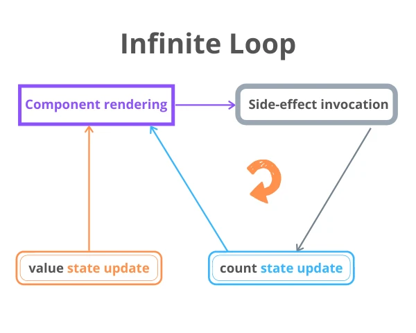

# Questions
## React Theoretical Questions
- [How Virtual DOM works. Explain in detail.](#Q1)
- [React steps to find differences in both Virtual DOM? (how diffing works in React)](#Q2)
- [What is the difference between Shadow DOM and Virtual DOM?](#Q3)
- [Why React is so popular?](#Q4)
- [Enlist advantages and lmitations of React.](#Q5)
- [What is React reconciliation? How does it work?](#Q6)
- [What makes DOM manipulation slow.](#Q7)
- [Difference between class components and functional components.](#Q8)
- [What is the difference between state and props.](#Q9)
- [What are the limitations with HOCs?](#Q10)
- [What are error boundaries in ReactJs?](#Q11)
- [Why should we not update the state directly?](#Q12)
- [How to enable production mode in React?](#Q13)
- [What are service workers.](#Q14)
- [What is CRA and its benefits?](#Q15)
- [What is React Router? How React Router is different from history library?](#Q16) 
- [Explain Atomic Design Pattern.](#Q17)
- [What do you mean by ~ or ^ in react package.json?](#Q18)

## React Hook based Questions
- [Explain usestate and useEffect.](#QA1)
- [How does useEffect work internally. Explain by fetching data with React Hooks?](#QA2)
- [How to pass data from child component to parent components?](#QA3)
- [Differences between controlled and uncontrolled components. Difference between state and ref. Give example.](#QA4)
- [What is a higher-order component? Give example.](#QA5)
- [Case of infinity loop in useEffect.](#QA6)
- [What is React router dom? Explain with an example.](#QA7)
- [How to re-render the view when the browser is resized?](#QA8)
- [How to handle asynchronous calls?](#QA9)
- [What is render props pattern? Explain some of the React Design Pattern.](#QA10)
- [What is code-splitting or dynamic import? Explain `React.lazy()` and `Suspense()`.](#QA11)
- [How to prevent re-renders on React functional components?](#QA12)
- [What are pure components? Explain with example](#QA13)
- [How do you memoize a component?](#QA14)
- [Explain useCallback()](#QA15)
- [useReducer, useContext hook](#QA16)
- [What is context API? or How can we avoid prop drilling?](#QA17)
- [What is Flux?](#QA18)
- [What is Redux? What are the core principles of Redux? Explain the flow.](#QA19)
- [Explain Redux Saga with an example.](#QA20)
- [What are synthetic events in React?](#QA21)
- [How you implement Server-Side Rendering or SSR?](#QA22)
- [Optimization hooks](#QA23)

## React Class based Questions
- [Lifecycle methods](#QB1)
- [Difference between state and ref.](#QB2)
- [What are pure components? Explain with example](#QB3)
- [What are React Event Handlers?](#QB4)
- [What are synthetic events in React?](#QB5)
- [What is the difference between mapStateToProps() and mapDispatchToProps()? Explain the flow of Redux in Class based component.](#QB6)

---

# Answers
#### Q1
### ✍How Virtual DOM works. Explain in detail
The *Virtual DOM (VDOM)* is an in-memory representation of Real DOM. The representation of a UI is kept in memory and synced with the "real" DOM. It's a step that happens between the render function being called and the displaying of elements on the screen. This entire process is called *reconciliation*.

The *Virtual DOM* works in three simple steps.

1. Whenever any underlying data changes, the entire UI is re-rendered in Virtual DOM representation.


2. Then the difference between the previous DOM representation and the new one is calculated.


3. Once the calculations are done, the real DOM will be updated with only the things that have actually changed.


- Updating virtual DOM in ReactJS is faster because ReactJS uses
ReactJS uses observable’s to find the modified components. Whenever setState() method is called on any component, ReactJS makes that component dirty and re-renders it. Creating the whole Virtual DOM from scratch is fast and doesn't affect performance. ReactJS maintains two virtual DOM, one with the updated state Virtual DOM and other with the previous state Virtual DOM.

- Efficient diffing algorithm
If the state of a component has changed, then ReactJS re-renders all the child components even if child components are not modified. To prevent the unwanted re-render of the child components we can use shouldComponentUpdate() component life cycle method.
ReactJS traverse the tree using BFS.
Reconciliation. It is the process to determine which parts of the Real DOM need to be updated.

- Batched update operations
ReactJS using the diff algorithm to find the minimum number of steps to update the Real DOM. Once it has these steps, it executes all the steps in one event loop without involving the steps to repaint the Real DOM.

**[⬆](#Questions)**
---
#### Q2
### ✍React steps to find differences in both Virtual DOM? (how diffing works in React)
Below is the DOM structure


Since DOM is represented as a tree structure, changes to the DOM is pretty quick but the changed element, and it’s children’s has to go through **Reflow/Layout** stage and then the changes has to be **Re-painted** which are slow. Therefore more the items to reflow/repaint, more slow your app becomes.

*What Virtual-DOM does is, it tries to minimize these two stages, and thereby getting a better performance for a big complex app.*

- First, making the component dirty.
- Next step is to update the *virtual DOM* and then use the *diffing algorithm* to do the *reconciliation* and update the actual DOM.

The reconciliation process is where React
- Compares the previous internal instance with the next internal instance.
- Updates the internal Instance which is a Component Tree structure in JavaScript Object(**Virtual DOM**).
- And updates the actual DOM only at the node where there is an actual change along with it’s children.

**[⬆](#Questions)**
---
#### Q3
### ✍What is the difference between Shadow DOM and Virtual DOM?
The *Shadow DOM* is a browser technology designed primarily for scoping variables and CSS in *web components*. The *Virtual DOM* is a concept implemented by libraries in JavaScript on top of browser APIs.

**[⬆](#Questions)**
---
#### Q4
### ✍Why React is so popular?
- React is declarative. When you write a component, you just tell React what do you want the DOM to look like, and just let React handle it from there.
- It uses VirtualDOM instead of RealDOM considering that RealDOM manipulations are expensive.
- Supports server-side rendering.
- Follows Unidirectional data flow or data binding.
- Uses reusable/composable UI components to develop the view.

**[⬆](#Questions)**
---
#### Q5
### ✍Enlist advantages and lmitations of React.
Main advantages of React
- Increases the application's performance with Virtual DOM.
- JSX makes code easy to read and write.
- It renders both on client and server side (SSR).
- Easy to integrate with frameworks (Angular, Backbone) since it is only a view library.
- Easy to write unit and integration tests with tools such as Jest.

Some limitations of React
- React is just a view library, not a full framework.
- There is a learning curve for beginners who are new to web development.
- Integrating React into a traditional MVC framework requires some additional configuration.
- The code complexity increases with inline templating and JSX.
- Too many smaller components leading to over engineering or boilerplate.

**[⬆](#Questions)**
---
#### Q6
### ✍What is React reconciliation? How does it work?
When a component's props or state change, React decides whether an actual DOM update is necessary by comparing the newly returned element with the previously rendered one. When they are not equal, React will update the DOM. This process is called *reconciliation*.

**[⬆](#Questions)**
---
#### Q7
### ✍What makes DOM manipulation slow.
The re-rendering or re-painting of the UI is what makes it slow. Therefore, the more UI components you have, the more expensive the DOM updates could be, since they would need to be re-rendered for every DOM update.

**[⬆](#Questions)**
---
#### Q8
### ✍Difference between class components and functional components.
- Syntax
A functional component is just a plain JavaScript function which accepts props as an argument and returns a React element. A class component requires you to extend from React.Component and create a render function which returns a React element.

- Handling state in Functional Components
To use state variables in a functional component, we need to use useState Hook, which takes an argument of initial state.

- Handling state in Class Components
The constructor for a React component is called before it is mounted. When implementing the constructor for a React.Component subclass, you should call super(props) before any other statement. Otherwise, this.props will be undefined in the constructor, which can lead to bugs.

- Passing Props
Inside a class component
```
<Component name="Amrit" />
```
Inside a functional component, we are passing props as an argument of the function (by destructuring).

*If the component needs state or lifecycle methods then use class component otherwise use function component. However, from React 16.8 with the addition of Hooks, you could use state , lifecycle methods and other features that were only available in class component right in your function component.* 

*So, it is always recommended to use Function components, unless you need a React functionality whose Function component equivalent is not present yet, like Error Boundaries*

**[⬆](#Questions)**
---
#### Q9
### ✍What is the difference between state and props.
- Both *props* and *state* are plain JavaScript objects. While both of them hold information that influences the output of render, they are different in their functionality with respect to component. Props get passed to the component similar to function parameters whereas state is managed within the component similar to variables declared within a function.
- *State* is owned locally and updated by the component itself. *Props* are owned by a parent component and are read-only. *Props* can only be updated if a callback function is passed to the child to trigger an upstream change.
- The *state* of a parent component can be passed a prop to the child. They are referencing the same value, but only the parent component can update it.

**[⬆](#Questions)**
---
#### Q10
### ✍What are the limitations with HOCs?
- **Don’t use HOCs inside the render method**: A new version of component will be created at every render, leading to performance issue.
- **Static methods must be copied over**: When you apply a HOC to a component the new component does not have any of the static methods of the original component
```jsx
// Define a static method
WrappedComponent.staticMethod = function() {/*...*/}
// Now apply a HOC
const EnhancedComponent = enhance(WrappedComponent);

// The enhanced component has no static method
typeof EnhancedComponent.staticMethod === 'undefined' // true
```

You can overcome this by copying the methods onto the container before returning it,

```jsx
function enhance(WrappedComponent) {
  class Enhance extends React.Component {/*...*/}
  // Must know exactly which method(s) to copy :(
  Enhance.staticMethod = WrappedComponent.staticMethod;
  return Enhance;
}
```

- **Refs aren’t passed through**: For HOCs you need to pass through all props to the wrapped component but this does not work for refs. This is because ref is not really a prop similar to key. In this case you need to use the `React.forwardRef` API

**[⬆](#Questions)**
---
#### Q11
### ✍What are error boundaries in ReactJs?
Error boundaries were introduced in React 16 as a way to catch and handle JavaScript errors that occur in the UI parts of our component. So error boundaries only catch errors that occur in a lifecycle method, render method, and inside Hooks like useEffect. 

A class component becomes an error boundary if it defines a new lifecycle method called `componentDidCatch(error, info)` or `static getDerivedStateFromError()` :
```jsx
class ErrorBoundary extends React.Component {
  constructor(props) {
    super(props)
    this.state = { hasError: false }
  }

  componentDidCatch(error, info) {
    // You can also log the error to an error reporting service
    logErrorToMyService(error, info)
  }

  static getDerivedStateFromError(error) {
     // Update state so the next render will show the fallback UI.
     return { hasError: true };
   }

  render() {
    if (this.state.hasError) {
      // You can render any custom fallback UI
      return <h1>{'Something went wrong.'}</h1>
    }
    return this.props.children
  }
}
```
To create an error boundary, we simply have to create a class component and define a state variable for determining whether the error boundary has caught an error. Our class component should also have at least three methods:
- A static method called `static getDerivedStateFromError`, which is used to update the error boundary’s state
- A `componentDidCatch` lifecycle method for performing operations when our error boundaries catch an error, such as logging to an error logging service.
- A `render` method for rendering our error boundary’s child or the fallback UI in case of an error.

After that, use it in a regular component.
```jsx
<ErrorBoundary>
  <MyWidget />
</ErrorBoundary>
```
React v15 provided very basic support for *error boundaries* using `unstable_handleError` method. It has been renamed to `componentDidCatch` in React v16.

**[⬆](#Questions)**
---
#### Q12
### ✍Why should we not update the state directly?
If you try to update the state directly then it won't re-render the component.
```jsx
//Wrong
this.state.message = 'Hello world'
```
Instead use `setState()` method. It schedules an update to a component's state object. When state changes, the component responds by re-rendering.
```jsx
//Correct
this.setState({ message: 'Hello World' });
```
**Note**: You can directly assign to the state object either in constructor or using latest javascript's class field declaration syntax.

**[⬆](#Questions)**
---
#### Q13
### ✍How to enable production mode in React?
You should use Webpack's `DefinePlugin` method to set `NODE_ENV` to `production`, by which it strip out things like propType validation and extra warnings. Apart from this, if you minify the code, for example, Uglify's dead-code elimination to strip out development only code and comments, it will drastically reduce the size of your bundle.

**[⬆](#Questions)**
---
#### Q14
### ✍What are service workers.
Service workers are scripts that are run by the browser. They do not have any direct relationship with the DOM. They provide many out of the box network-related features. Service workers are the foundation of building an offline experience. They enable features such as push notifications and background sync.

- They improve the performance of your website. Caching key parts of your website only helps in making it load faster.
- Enhances user experience through an offline-first outlook. Even if one loses connectivity, one can continue to use the application normally.
- They enable notification and push APIs, which are not available through traditional web technologies.
- They enable you to perform background sync. You can defer certain actions until network connectivity is restored to ensure a seamless experience to the user.

**[⬆](#Questions)**
---
#### Q15
### ✍What is CRA and its benefits?
The `create-react-app` CLI tool allows you to quickly create & run React applications with no configuration step.

```console
# Installation
$ npm install -g create-react-app

# Create new project
$ create-react-app todo-app
$ cd todo-app

# Build, test and run
$ npm run build
$ npm run test
$ npm start
```

It includes everything we need to build a React app:
- React, JSX, ES6, and Flow syntax support.
- Language extras beyond ES6 like the object spread operator.
- Autoprefixed CSS, so you don’t need -webkit- or other prefixes.
- A fast interactive unit test runner with built-in support for coverage reporting.
- A live development server that warns about common mistakes.
- A build script to bundle JS, CSS, and images for production, with hashes and sourcemaps.

**[⬆](#Questions)**
---
#### Q16
### ✍What is React Router? How React Router is different from history library?
React Router is the standard routing library for React. From the docs: *“React Router keeps your UI in sync with the URL. It has a simple API with powerful features like lazy code loading, dynamic route matching, and location transition handling built right in.*

React Router is a wrapper around the `history` library which handles interaction with the browser's `window.history` with its browser and hash histories. It also provides memory history which is useful for environments that don't have global history, such as mobile app development (React Native) and unit testing with Node.

**[⬆](#Questions)**
---
#### Q17
### ✍Explain Atomic Design Pattern.
Atomic design, developed by Brad Frost and Dave Olsen, is a methodology for crafting design systems with five fundamental building blocks, which, when combined, promote consistency, modularity, and scalability.

The five distinct levels of atomic design — atoms > molecules > organisms > templates > pages — map incredibly well to React’s component-based architecture.
- **Atoms**: Basic building blocks of matter, such as a button, input or a form label. They’re not useful on their own.
- **Molecules**: Grouping atoms together, such as combining a button, input and form label to build functionality.
- **Organisms**: Combining molecules together to form organisms that make up a distinct section of an interface (i.e. navigation bar)
- **Templates**: Consisting mostly of groups of organisms to form a page — where clients can see a final design in place.
- **Pages**: An ecosystem that views different template renders. We can create multiple ecosystems into a single environment — the application.

**[⬆](#Questions)**
---
#### Q18
### ✍What do you mean by ~ or ^ in react package.json?
Example : the react version is specified as *^16.6.3*, which means that npm will install the most recent major version matching 16.x.x. In contrast if you see something like *~5.6.7* in package.json, it means that it will install the most recent minor version matching 5.6.x.

**[⬆](#Questions)**
---
#### QA1
### ✍Explain usestate and useEffect.
- `useState` is a hook that encapsulates local state management. `useState` saves us from having to create class-based components for state-related responsibilities, since it gives functional components the power and flexibility to handle it themselves.

```jsx
const [state, setState] = useState(initialstate)
```

- `useEffect` is a hook for encapsulating code that has ‘side effects,’ and is like a combination of componentDidMount, componentDidUpdate, and componentWillUnmount. Previously, functional components didn’t have access to the component life cycle, but with `useEffect` you can tap into it.

```jsx
useEffect(callback[, dependencies]);
```

**[⬆](#Questions)**
---
#### QA2
### ✍How does useEffect work internally. Explain by fetching data with React Hooks?
By default, `useEffect` runs after each render of the component where it’s called.

When you call `useEffect` in your component, this is effectively queuing or scheduling an effect to maybe run, after the render is done.

After rendering finishes, `useEffect` will check the list of dependency values against the values from the last render, and will call your effect function if any one of them has changed.

```jsx
import React, { useState, useEffect } from 'react';
import axios from 'axios';

function App() {
  const [data, setData] = useState({ hits: [] });

  useEffect(() => {
    (async () => {
      const result = await axios(
        'http://hn.algolia.com/api/v1/search?query=react',
      );

      setData(result.data);
    })()
  }, []);

  return (
    <ul>
      {data.hits.map(item => (
        <li key={item.objectID}>
          <a href={item.url}>{item.title}</a>
        </li>
      ))}
    </ul>
  );
}

export default App;
```

**[⬆](#Questions)**
---
#### QA3
### ✍How to pass data from child component to parent components?
- Create a callback function in the parent component. This callback function will get the data from the child component.
- Pass the callback function in the parent as a prop to the child component.
- The child component calls the parent callback function using `props`.

```jsx
import React from 'react';

class Parent extends React.Component{
  constructor(props){
    super(props);
    this.state = {
      data: null
    }
  }

  handleCallback = (childData) =>{
    this.setState({data: childData})
  }

  render(){
    const {data} = this.state;
    return(
      <div>
        <Child parentCallback = {this.handleCallback}/>
        {data}
      </div>
    )
  }
}

class Child extends React.Component{
  onTrigger = (event) => {
    this.props.parentCallback("Data from child");
    event.preventDefault();
  }

  render(){
    return(
      <div>
        <form onSubmit = {this.onTrigger}>
          <input type = "submit" value = "Submit"/>
        </form>
      </div>
    )
  }
}

export default Parent;
```

**[⬆](#Questions)**
---
#### QA4
### ✍Differences between controlled and uncontrolled components. Difference between state and ref. Give example.
The **Uncontrolled Components** are the ones that store their own state internally, and you query the DOM using a ref to find its current value when you need it. This is a bit more like traditional HTML.

- In most cases, it's recommend to use controlled components to implement forms. In a controlled component, form data is handled by a React component. The alternative is uncontrolled components, where form data is handled by the DOM itself. Instead of writing an event handler for all of your state updates, you use a ref to retrieve values from the DOM. Example: manage focus, getting width and height of DIV element.

`useState` would be used in the cases when we want to maintain and update the properties during the re-rendering of view. We will use `useRef` if we want to persist the values throughout the lifetime of the component.

The *ref* is used to return a reference to the element. *They should be avoided in most cases*, however, they can be useful when you need a direct access to the DOM element or an instance of a component.

You can use `ref` in hooks like this:
```jsx
import React, { forwardRef } from "react";

const Component1 = (props, ref) => {
  return <div ref = {ref}>
    I'm Component 1 and width is: {props.width}
  </div>
}

// React HOC Pattern
export default getDimensions(forwardRef(Component1));

// getDimensions.js
import React, { useState, useEffect, useRef } from "react";

const getDimensions = (Element) => {
  function GetDimensions(props) {

    const [width, setWidth] = useState(0);
    const ref1 = useRef();

    useEffect(() => {
      if (ref1.current) {
        setWidth(ref1.current.offsetWidth);
      }
    }, [ref1])

    return <Element ref={ref1} width={width} {...props} />
  }

  return GetDimensions;
}

export default getDimensions;
```

**[⬆](#Questions)**
---
#### QA5
### ✍What is a higher-order component? Give example.
A *higher-order component (HOC)* is a function that takes a component, adds some logic and returns that component with that additional logic. Basically, it's a pattern that is derived from React's compositional nature.

We call them **pure components** because they can accept any dynamically provided child component but they won't modify or copy any behavior from their input components.

```js
const EnhancedComponent = higherOrderComponent(WrappedComponent)
```

HOC can be used for many use cases:
- Code reuse, logic and bootstrap abstraction.
- Render hijacking.
- State abstraction and manipulation.
- Props manipulation.

**[⬆](#Questions)**
---
#### QA6
### ✍Case of infinity loop in useEffect.
When we call `useEffect` without any dependencies argument, it generates *an infinite loop of component re-renderings*. Hence we have to include a dependency argument.

**Component Update without dependency argument**
```jsx
import { useEffect, useState } from 'react';
function CountInputChanges() {
  const [value, setValue] = useState('');
  const [count, setCount] = useState(-1);

  useEffect(() => setCount(count + 1));

  const onChange = ({ target }) => setValue(target.value);

  return (
    <div>
      <input type="text" value={value} onChange={onChange} />
      <div>Number of changes: {count}</div>
    </div>
  )
}
```

**Component Update with dependency argument**
```jsx
import { useEffect, useState } from 'react';
function CountInputChanges() {
  const [value, setValue] = useState('');
  const [count, setCount] = useState(-1);

  useEffect(() => setCount(count + 1), [value]);

  const onChange = ({ target }) => setValue(target.value);

  return (
    <div>
      <input type="text" value={value} onChange={onChange} />
      <div>Number of changes: {count}</div>
    </div>
  )
}
```


**[⬆](#Questions)**
---
#### QA7
### ✍What is React router dom? Explain with an example.
`react-router-dom` is a specialized package that you can use only in web-browser-based application development.

- Implement the basic routing
```jsx
import React from "react";
import { BrowserRouter as Router, Switch, Route, Link } from "react-router-dom";

export default function BasicExample() {
  return (
    <Router>
      <div>
        <ul>
          <li>
            <Link to="/">Home</Link>
          </li>
          <li>
            <Link to="/about">About</Link>
          </li>
        </ul>
        <Switch>
          <Route exact path="/">
            <Home />
          </Route>
          <Route path="/about">
            <About />
          </Route>
        </Switch>
      </div>
    </Router>
  );
}

// You can think of these components as "pages" in your app.

function Home() {
  return (
    <div>
      <h2>Home</h2>
    </div>
  );
}

function About() {
  return (
    <div>
      <h2>About</h2>
    </div>
  );
}
```

- Implement routing with URL parameters
```jsx
<Switch>
  <Route path="/:id" children={<Child />} />
</Switch>
 
function Child() {
  let { id } = useParams();

  return (
    <div>
      <h3>ID: {id}</h3>
    </div>
  );
}
```

- Implement routing with Redirect
```jsx
// - A <Switch> renders the first child <Route> that matches
// - A <Redirect> may be used to redirect old URLs to new ones
// - A <Route path="*> always matches

<Switch>
  <Route exact path="/">
    <Home />
  </Route>
  <Route path="/old-match">
    <Redirect to="/will-match" />
  </Route>
  <Route path="/will-match">
    <WillMatch />
  </Route>
  <Route path="*">
    <NoMatch />
  </Route>
</Switch>
```

**[⬆](#Questions)**
---
#### QA8
### ✍How to re-render the view when the browser is resized?
You can listen to the resize event in `componentDidMount()` and then update the dimensions (width and height). You should remove the listener in `componentWillUnmount()` method.

```jsx
class WindowDimensions extends React.Component {
  constructor(props) {
    super(props);
    this.updateDimensions = this.updateDimensions.bind(this);
  }
   
  componentWillMount() {
    this.updateDimensions()
  }

  componentDidMount() {
    window.addEventListener('resize', this.updateDimensions)
  }

  componentWillUnmount() {
    window.removeEventListener('resize', this.updateDimensions)
  }

  updateDimensions() {
    this.setState({width: window.innerWidth, height: window.innerHeight})
  }

  render() {
    return <span>{this.state.width} x {this.state.height}</span>
  }
}
```

**[⬆](#Questions)**
---
#### QA9
### ✍How to handle asynchronous calls?
Refer to QA2 [How does useEffect work internally. Explain by fetching data with React Hooks?](#QA2)

**[⬆](#Questions)**
---
#### QA10
### ✍What is render props pattern? Explain some of the React Design Pattern.
The term **render props** refers to a simple technique for sharing code between React components using a prop whose value is a function.
```jsx
<Route path='/page' component={Page} />
const extraProps = { color: 'red' }

<Route path='/page' render={(props) => (
  <Page {...props} data={extraProps}/>
)}/>
```
Some of the React Design Pattern are:
- React HOC Pattern
- React Render Props Pattern
- React Compound Pattern (While implementing a Multiple Tab Component)
- React Hooks Pattern

Example of these patterns are given below
https://react-hzgrec.stackblitz.io

**[⬆](#Questions)**
---
#### QA11
### ✍What is code-splitting or dynamic import? Explain `React.lazy()` and `Suspense()`.
The `code-splitting` or `dynamic import()` syntax is a ECMAScript proposal not currently part of the language standard. It is expected to be accepted in the near future. You can achieve code-splitting into your app using dynamic import.

**Normal import**
```js
import { add } from './math';
console.log(add(10, 20));
```
**Dynamic import**
```js
import("./math").then(math => {
  console.log(math.add(10, 20));
});
```

The `React.lazy` function lets you render an dynamic import as a regular component. It will automatically load the bundle containing the OtherComponent when the component gets rendered. This must return a Promise which resolves to a module with a default export containing a React component.
```jsx
const OtherComponent = React.lazy(() => import('./OtherComponent'));
```

If the module containing the dynamic import is not yet loaded by the time parent component renders, you must show some fallback content while you’re waiting for it to load using a loading indicator. This can be done using **Suspense** component.
```jsx
import React, { Suspense } from 'react';

const Header = React.lazy(() => import("./Header"));
const Footer = React.lazy(() => import("./Footer"));

export default function App() {
  return (
    <div className="App">
      <Suspense fallback={<div>Header Loading...</div>}>
        <Header />
      </Suspense>
      <Suspense fallback={<div>Footer Loading...</div>}>
        <Footer />
      </Suspense>
    </div>
  )
}
```

**[⬆](#Questions)**
---
#### QA12
### ✍How to prevent re-renders on React functional components?
To optimize, and prevent multiple React renders, `React.memo()` is used.
In programming, memoization is an optimization technique. It’s primarily used to speed up computing by story the result of a function and returning the cached result, when the same inputs occur again.

Since React v16.6.0, we have a `React.memo`. It provides a higher order component which memoizes component unless the props change. To use it, simply wrap the component using `React.memo` before you use it.

```jsx
const MemoComponent = React.memo(function MemoComponent(props) {
  /* render using props */
});

// another way
export default React.memo(MyFunctionComponent);
```

**[⬆](#Questions)**
---
#### QA13
### ✍What are pure components? Explain with example
`React.PureComponent` is exactly the same as `React.Component` except that it handles the `shouldComponentUpdate()` method for you. When props or state changes, PureComponent will do a shallow comparison on both props and state. Component on the other hand won't compare current props and state to next out of the box. Thus, the component will re-render by default whenever shouldComponentUpdate is called.

A React component is considered pure if it renders the same output for the same state and props.
Pure components have some performance improvements and render optimizations since React implements the shouldComponentUpdate() method for them with a shallow comparison for props and state.

```jsx
// FUNCTIONAL COMPONENT
function PercentageStat({ label, score = 0, total = Math.max(1, score) }) {
  return (
    <div>
      <h6>{ label }</h6>
      <span>{ Math.round(score / total * 100) }%</span>
    </div>
  )
}

// CONVERTED TO PURE COMPONENT
class PercentageStat extends React.PureComponent {
  render() {
    const { label, score = 0, total = Math.max(1, score) } = this.props;

    return (
      <div>
        <h6>{ label }</h6>
        <span>{ Math.round(score / total * 100) }%</span>
      </div>
    )
  }

}
```

**[⬆](#Questions)**
---
#### QA14
### ✍How do you memoize a component?
To optimize, and prevent multiple React renders, `React.memo()` is used.
In programming, memoization is an optimization technique. It’s primarily used to speed up computing by story the result of a function and returning the cached result, when the same inputs occur again.

Since React v16.6.0, we have a `React.memo`. It provides a higher order component which memoizes component unless the props change. To use it, simply wrap the component using `React.memo` before you use it.
```jsx
const MemoComponent = React.memo(function MemoComponent(props) {
  /* render using props */
});

// another way
export default React.memo(MyFunctionComponent);
```
`useMemo()` is a React Hook that we can use to wrap functions within a component. We can use this to ensure that the values within that function are re-computed only when one of its dependencies change.
```jsx
const memoizedValue = useMemo(() => computeExpensiveValue(a, b), [a, b]);
```

**[⬆](#Questions)**
---
#### QA15
### ✍Explain useCallback()
```jsx
const memoizedCallback = useCallback(
  () => {
    doSomething(a, b);
  },
  [a, b],
);
```

`useCallback()` returns a *memoized* callback.

###### Purpose
An object (including a function object) equals only to itself.

```jsx
function MyComponent() {
  // handleClick is re-created on each render
  const handleClick = () => {
    console.log('Clicked!');
  };
  // ...
}
```

`handleClick` is a different function object on every rendering of `MyComponent`.

Consider a component that renders a big list of items. The list could be big, maybe hundreds of items. To prevent useless list re-renderings, you wrap it into `React.memo()`. 

```jsx
// A good use case
import { useCallback } from 'react';
export function MyParent({ term }) {
  const onItemClick = useCallback(event => {
    console.log('You clicked ', event.currentTarget);
  }, [term]);

  return (
    <MyBigList
      term={term}
      onItemClick={onItemClick}
    />
  );
}
```

`onItemClick` callback is memoized by `useCallback()`. As long as term is the same, `useCallback()` returns the same function object. When `MyParent` component re-renders, `onItemClick` function object remains the same and doesn't break the memoization of `MyBigList`. This is a good example of `useCallback()`.

```jsx
// A BAD use case
import { useCallback } from 'react';
function MyComponent() {
  // Contrived use of `useCallback()`
  const handleClick = useCallback(() => {
    // handle the click event
  }, []);
  return <MyChild onClick={handleClick} />;
}

function MyChild ({ onClick }) {
  return <button onClick={onClick}>I am a child</button>;
}
```

- `<MyChild>` component is light and its re-rendering doesn't create performance issues.
- `useCallback()` hook is called every time `MyComponent` renders.
- By using `useCallback()` you also increased code complexity

**[⬆](#Questions)**
---
#### QA16
### ✍useReducer, useContext hook
`useReducer` is an alternative to `useState`. Accepts a reducer of type `(state, action) => newState`, and returns the current state paired with a `dispatch` method.

```jsx
const [state, dispatch] = useReducer(reducer, initialArg, init);
```

`useReducer` is usually preferable to useState when you have complex state logic that involves multiple sub-values or when the next state depends on the previous one. `useReducer` also lets you optimize performance for components that trigger deep updates because you can pass dispatch down instead of callbacks.

```jsx
const initialState = {count: 0};

function reducer(state, action) {
  switch (action.type) {
    case 'increment':
      return {count: state.count + 1};
    case 'decrement':
      return {count: state.count - 1};
    default:
      throw new Error();
  }
}

function Counter() {
  const [state, dispatch] = useReducer(reducer, initialState);
  return (
    <>
      Count: {state.count}
      <button onClick={() => dispatch({type: 'decrement'})}>-</button>
      <button onClick={() => dispatch({type: 'increment'})}>+</button>
    </>
  );
}
```

`useContext` accepts a context object (the value returned from `React.createContext`) and returns the current context value for that context. The current context value is determined by the value prop of the nearest `<MyContext.Provider>` above the calling component in the tree.

```jsx
const value = useContext(MyContext);
```

When the nearest `<MyContext.Provider>` above the component updates, this Hook will trigger a rerender with the latest context value passed to that MyContext provider. Even if an ancestor uses `React.memo` or `shouldComponentUpdate`, a rerender will still happen starting at the component itself using `useContext`.

```jsx
const themes = {
  light: {
    foreground: "#000000",
    background: "#eeeeee"
  },
  dark: {
    foreground: "#ffffff",
    background: "#222222"
  }
};

const ThemeContext = React.createContext(themes.light);

function App() {
  return (
    <ThemeContext.Provider value={themes.dark}>
      <Toolbar />
    </ThemeContext.Provider>
  );
}

function Toolbar(props) {
  return (
    <div>
      <ThemedButton />
    </div>
  );
}

function ThemedButton() {
  const theme = useContext(ThemeContext);
  return (
    <button style={{ background: theme.background, color: theme.foreground }}>
      I am styled by theme context!
    </button>
  );
}
```

**[⬆](#Questions)**
---
#### QA17
### ✍What is context API? or How can we avoid prop drilling?


**[⬆](#Questions)**
---
#### QA18
### ✍What is Flux?
*Flux is an application design paradigm* used as a replacement for the more traditional MVC pattern. It is a new kind of architecture that complements React and the concept of Unidirectional Data Flow.

The workflow between dispatcher, stores and views components with distinct inputs and outputs as follows:


**[⬆](#Questions)**
---
#### QA19
### ✍What is Redux? What are the core principles of Redux? Explain the flow.
*Redux* is a predictable state container for JavaScript apps based on the *Flux design pattern*. Redux can be used together with React, or with any other view library. It is tiny (about 2kB) and has no dependencies.


The core principles of Redux:
- **Single source of truth**: The state of your whole application is stored in an object tree within a single store. The single state tree makes it easier to keep track of changes over time and debug or inspect the application.
- **State is read-only**: The only way to change the state is to emit an action, an object describing what happened. This ensures that neither the views nor the network callbacks will ever write directly to the state.
- **Changes are made with pure functions**: To specify how the state tree is transformed by actions, you write reducers. Reducers are just pure functions that take the previous state and an action as parameters, and return the next state.

**Note**: Redux is synchronous. We add middleware like thunk and saga to handle asynchronous functions.

**[⬆](#Questions)**
---
#### QA20
### ✍Explain Redux Saga with an example.


**[⬆](#Questions)**
---
#### QA21
### ✍What are synthetic events in React?
`SyntheticEvent` is a cross-browser wrapper around the browser's native event. It's API is same as the browser's native event, including `stopPropagatiPrinciples why React is so popular?on()` and `preventDefault()`, except the events work identically across all browsers.

**[⬆](#Questions)**
---
#### QA22
### ✍How you implement Server-Side Rendering or SSR?
React is already equipped to handle rendering on Node servers. A special version of the DOM renderer is available, which follows the same pattern as on the client side.
```jsx
import ReactDOMServer from 'react-dom/server'
import App from './App'

ReactDOMServer.renderToString(<App />)
```
This method will output the regular HTML as a string, which can be then placed inside a page body as part of the server response. On the client side, React detects the pre-rendered content and seamlessly picks up where it left off.

**[⬆](#Questions)**
---
#### QA23
### ✍Optimization hooks


**[⬆](#Questions)**
---
#### QB1
### ✍Lifecycle methods
The component lifecycle has three distinct lifecycle phases:
- **Mounting**: The component is ready to mount in the browser DOM. This phase covers initialization from `constructor()`, `getDerivedStateFromProps()`, `render()`, and `componentDidMount()` lifecycle methods.
- **Updating**: In this phase, the component gets updated in two ways, sending the new props and updating the state either from `setState()` or `forceUpdate()`. This phase covers `getDerivedStateFromProps()`, `shouldComponentUpdate()`, `render()`, `getSnapshotBeforeUpdate()` and `componentDidUpdate()` lifecycle methods.
- **Unmounting**: In this last phase, the component is not needed and gets unmounted from the browser DOM. This phase includes `componentWillUnmount()` lifecycle method.

It's worth mentioning that React internally has a concept of phases when applying changes to the DOM. They are separated as follows:
- **Render** The component will render without any side-effects. This applies for Pure components and in this phase, React can pause, abort, or restart the render.
- **Pre-commit** Before the component actually applies the changes to the DOM, there is a moment that allows React to read from the DOM through the `getSnapshotBeforeUpdate()`.
- **Commit** React works with the DOM and executes the final lifecycles respectively `componentDidMount()` for mounting, `componentDidUpdate()` for updating, and `componentWillUnmount()` for unmounting.

React 16.3+ Phases


Before React 16.3+ 


The lifecycle methods of React before 16.3
Before React 16.3
- **componentWillMount**: Executed before rendering and is used for App level configuration in your root component.
- **componentDidMount**: Executed after first rendering and here all AJAX requests, DOM or state updates, and set up event listeners should occur.
- **componentWillReceiveProps**: Executed when particular prop updates to trigger state transitions.
- **shouldComponentUpdate**: Determines if the component will be updated or not. By default it returns `true`. If you are sure that the component doesn't need to render after state or props are updated, you can return false value. It is a great place to improve performance as it allows you to prevent a re-render if component receives new prop.
- **componentWillUpdate**: Executed before re-rendering the component when there are props & state changes confirmed by `shouldComponentUpdate()` which returns true.
- **componentDidUpdate**: Mostly it is used to update the DOM in response to prop or state changes.
- **componentWillUnmount**: It will be used to cancel any outgoing network requests, or remove all event listeners associated with the component.

The lifecycle methods of React after 16.3
- **getDerivedStateFromProps**: Invoked right before calling `render()` and is invoked on every render. This exists for rare use cases where you need derived state.
- **componentDidMount**: Executed after first rendering and where all AJAX requests, DOM or state updates, and set up event listeners should occur.
- **shouldComponentUpdate**: Determines if the component will be updated or not. By default it returns true.
- **getSnapshotBeforeUpdate**: Executed right before rendered output is committed to the DOM. Any value returned by this will be passed into `componentDidUpdate()`. This is useful to capture information from the DOM i.e. scroll position.
- **componentDidUpdate**: Mostly it is used to update the DOM in response to prop or state changes. This will not fire if `shouldComponentUpdate()` returns `false`.
- **componentWillUnmount** It will be used to cancel any outgoing network requests, or remove all event listeners associated with the component.

###### The lifecycle methods are called in the following order when an instance of a component is being created and inserted into the DOM.
- `constructor()`
- `static getDerivedStateFromProps()`
- `render()`
- `componentDidMount()`

**[⬆](#Questions)**
---
#### QB2
### ✍Difference between state and ref.
The *ref* is used to return a reference to the element. *They should be avoided in most cases*, however, they can be useful when you need a direct access to the DOM element or an instance of a component.

- You can create *ref* by using `React.createRef()` method
```jsx
class MyComponent extends React.Component {
  constructor(props) {
    super(props)
    this.myRef = React.createRef()
  }
  render() {
    return <div ref={this.myRef} />
  }
}
```
- You can also use *ref callbacks approach* regardless of React version. For example, the search bar component's input element accessed as follows:
```jsx
class SearchBar extends Component {
   constructor(props) {
      super(props);
      this.txtSearch = null;
      this.state = { term: '' };
      this.setInputSearchRef = e => {
         this.txtSearch = e;
      }
   }
   onInputChange(event) {
      this.setState({ term: this.txtSearch.value });
   }
   render() {
      return (
         <input
            value={this.state.term}
            onChange={this.onInputChange.bind(this)}
            ref={this.setInputSearchRef} />
      );
   }
}
```

**[⬆](#Questions)**
---
#### QB3
### ✍What are pure components? Explain with example
`React.PureComponent` is exactly the same as `React.Component` except that it handles the `shouldComponentUpdate()` method for you. When props or state changes, PureComponent will do a shallow comparison on both props and state. Component on the other hand won't compare current props and state to next out of the box. Thus, the component will re-render by default whenever shouldComponentUpdate is called.

A React component is considered pure if it renders the same output for the same state and props.
Pure components have some performance improvements and render optimizations since React implements the shouldComponentUpdate() method for them with a shallow comparison for props and state.

```jsx
// FUNCTIONAL COMPONENT
function PercentageStat({ label, score = 0, total = Math.max(1, score) }) {
  return (
    <div>
      <h6>{ label }</h6>
      <span>{ Math.round(score / total * 100) }%</span>
    </div>
  )
}

// CONVERTED TO PURE COMPONENT
class PercentageStat extends React.PureComponent {
  render() {
    const { label, score = 0, total = Math.max(1, score) } = this.props;

    return (
      <div>
        <h6>{ label }</h6>
        <span>{ Math.round(score / total * 100) }%</span>
      </div>
    )
  }
}
```

**[⬆](#Questions)**
---
#### QB4
### ✍What are React Event Handlers?
- **binding in constructor**:

```jsx
class Foo extends Component {
  constructor(props) {
    super(props);
    this.handleClick = this.handleClick.bind(this);
  }
  handleClick() {
    console.log('Click happened');
  }
  render() {
    return <button onClick={this.handleClick}>Click Me</button>;
  }
}
```

- **Public class fields syntax**:
```jsx
handleClick = () => {
  console.log('this is:', this)
}

<button onClick={this.handleClick}>
  {'Click me'}
</button>
```

- **Arrow functions in callbacks**:
```jsx
handleClick() {
  console.log('Click happened');
}
render() {
  return <button onClick={() => this.handleClick()}>Click Me</button>;
}
```
**Note**: If the callback is passed as prop to child components, those components might do an extra re-rendering. In those cases, it is preferred to go with .bind() or public class fields syntax approach considering performance.

**[⬆](#Questions)**
---
#### QB5
### ✍What are synthetic events in React?
`SyntheticEvent` is a cross-browser wrapper around the browser's native event. It's API is same as the browser's native event, including `stopPropagation()` and `preventDefault()`, except the events work identically across all browsers.

**[⬆](#Questions)**
---
#### QB6
### ✍What is the difference between mapStateToProps() and mapDispatchToProps()? Explain the flow of Redux in Class based component.
`mapStateToProps()` is a utility which helps your component get updated state (which is updated by some other components):

```jsx
const mapStateToProps = (state) => {
  return {
    todos: getVisibleTodos(state.todos, state.visibilityFilter)
  }
}
```

`mapDispatchToProps()` is a utility which will help your component to fire an action event (dispatching action which may cause change of application state):

```jsx
const mapDispatchToProps = (dispatch) => {
  return {
    onTodoClick: (id) => {
      dispatch(toggleTodo(id))
    }
  }
}
```

You can dispatch an action in `componentDidMount()` method and in `render()` method you can verify the data.

```jsx
class App extends Component {
  componentDidMount() {
    this.props.fetchData()
  }

  render() {
    return this.props.isLoaded
      ? <div>{'Loaded'}</div>
      : <div>{'Not Loaded'}</div>
  }
}

const mapStateToProps = (state) => ({
  isLoaded: state.isLoaded
})

const mapDispatchToProps = { fetchData }

export default connect(mapStateToProps, mapDispatchToProps)(App)
```

**[⬆](#Questions)**
---

